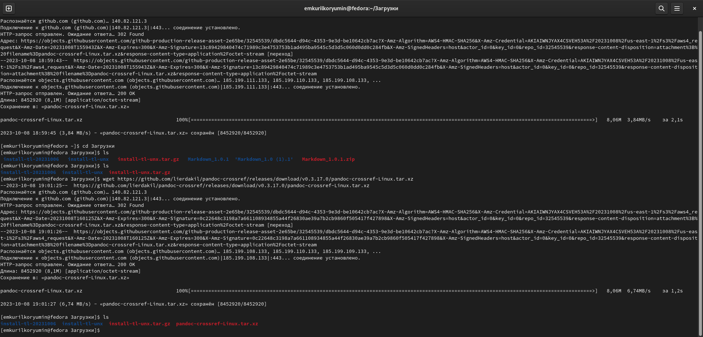
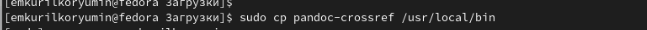
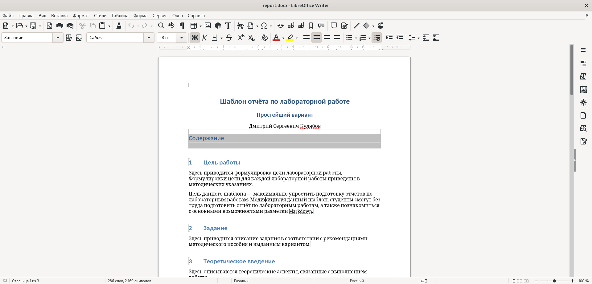
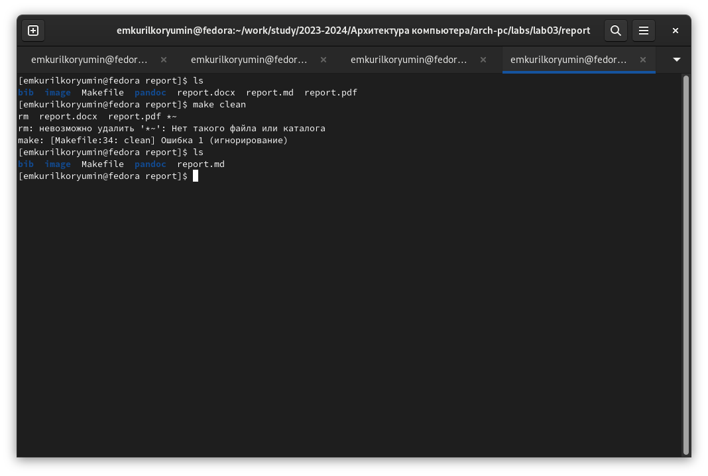

---
## Front matter
title: "отчёт по лабораторной работе№3"
subtitle: "Дисциплина:Архитектура компьютера"
author: "Курилко-Рюмин Евгений Михайлович"

## Generic otions
lang: ru-RU
toc-title: "Содержание"

## Bibliography
bibliography: bib/cite.bib
csl: pandoc/csl/gost-r-7-0-5-2008-numeric.csl

## Pdf output format
toc: true # Table of contents
toc-depth: 2
lof: true # List of figures
lot: true # List of tables
fontsize: 12pt
linestretch: 1.5
papersize: a4
documentclass: scrreprt
## I18n polyglossia
polyglossia-lang:
  name: russian
  options:
	- spelling=modern
	- babelshorthands=true
polyglossia-otherlangs:
  name: english
## I18n babel
babel-lang: russian
babel-otherlangs: english
## Fonts
mainfont: PT Serif
romanfont: PT Serif
sansfont: PT Sans
monofont: PT Mono
mainfontoptions: Ligatures=TeX
romanfontoptions: Ligatures=TeX
sansfontoptions: Ligatures=TeX,Scale=MatchLowercase
monofontoptions: Scale=MatchLowercase,Scale=0.9
## Biblatex
biblatex: true
biblio-style: "gost-numeric"
biblatexoptions:
  - parentracker=true
  - backend=biber
  - hyperref=auto
  - language=auto
  - autolang=other*
  - citestyle=gost-numeric
## Pandoc-crossref LaTeX customization
figureTitle: "Рис."
tableTitle: "Таблица"
listingTitle: "Листинг"
lofTitle: "Список иллюстраций"
lotTitle: "Список таблиц"
lolTitle: "Листинги"
## Misc options
indent: true
header-includes:
  - \usepackage{indentfirst}
  - \usepackage{float} # keep figures where there are in the text
  - \floatplacement{figure}{H} # keep figures where there are in the text
---

# Цель работы

Цель данной работы является приобритение практического опыта работы с легковесным языком Markdown.

# Задание

1. Установка необходимого ПО.
2. Заполнение отчета по выполнению лабораторной работы №3 с помощью языка разметки Markdown.
3. Выполнение заданий для самостоятельной работы

# Теоретическое введение

Markdown - легковесный язык разметки, созданный с целью обозначения форматирования в простом тексте,
с максимальным сохранением его читаемости. Markdown поддерживает как встраивание фрагментов кода в предложение, так и их размещение между предложениями в виде отдельных огражденных блоков. Огражденные блоки
кода — это простой способ выделить синтаксис для фрагментов кода. Внутритекстовые формулы делаются аналогично формулам LaTeX. В Markdown вставить изображение в документ можно с помощью непосредственного указания адреса
изображения

# Выполнение лабораторной работы

1. Установка необходимого ПО

 Скачиваю TexLive с официального сайта и распаковываю архив.Затем запускаю скрипт install-tl  правами root, используя sudo в начале команды. (рис. 1).
 

Установка TexLive (рис. 2).

[Установка](image/lab3/2.png)

  Скачиваю архив pandoc и pandoc-crossref c официального github (рис. 3).
 

  Распаковываю скачанные архивы, копирую файлы pandoc и pandoc-crossref в каталог /usr/local/bin/ с правами пользователя root, используя sudo. (рис. 4).
  (рис. 5).

Проверяю правильность моих действий.(рис. 6).

2. Открыв терминал, перехожу в каталог курса, сформированный при выполненнии прошлой лаборатной работы. Обновляю локальный репозиторий.(рис. 7).

Перехожу в каталог с шаблоном отчета по лабораторной работе №3 и компилирую шаблон с использованием Makefile, введя команду make.Проверяю правильность выполнения команды. (рис. 8).
 

  Открываю сгенерированный файл report.docx  (рис. 9).
 

  Открываю сгенерированный файл report.pdf (рис. 10)

  Удаляю полученные файлы с использованием Makefile, вводя команду make clean. Проверяю.(рис. 11).
 

  Открываю файл report.md с помощью gedit (рис. 12).
 

  Копирую файл с новым названием с помощью утилиты cp (рис. 13).

  Открываю файл, начинаю заполнять отчёт(рис. 14).
 

# Выполнение заданий для лабораторной работы

  1. Перехожу в директорию lab02/report с помощью cd, чтобы там заполнять отчет по второй лабораторной работе.(рис. 15).
 

Копирую файл report.md с новым именем для заполнения отчета (рис.16)

Открываю файл и начинаю работу по заполнению отчета(рис .17)

  2. Делаю компиляцию файлов (рис. 18).
 

  3. Удаляю ненужные файлы (рис. 19).
 
 
 
  4. Добавляю все на GitHub с помощью git add и сохраняю изменения с помощью git commit. (рис. 20).
 

  5. Отправляю файлы на сервер с помощью команды. (рис. 21).
 

# Вывод

  Я приобрёл практический опыт работы с легковесным языком Markdown.
 
# Список литературы
 
   1. Архитектура ЭВМ

