---
## Front matter
title: "Отчёт по лабораторной работе №5"
subtitle: "Дисциплина: Архитектура Компьютера"
author: "Курилко-Рюмин Евгений"

## Generic otions
lang: ru-RU
toc-title: "Содержание"

## Bibliography
bibliography: bib/cite.bib
csl: pandoc/csl/gost-r-7-0-5-2008-numeric.csl

## Pdf output format
toc: true # Table of contents
toc-depth: 2
lof: true # List of figures

fontsize: 12pt
linestretch: 1.5
papersize: a4
documentclass: scrreprt
## I18n polyglossia
polyglossia-lang:
  name: russian
  options:
	- spelling=modern
	- babelshorthands=true
polyglossia-otherlangs:
  name: english
## I18n babel
babel-lang: russian
babel-otherlangs: english
## Fonts
mainfont: PT Serif
romanfont: PT Serif
sansfont: PT Sans
monofont: PT Mono
mainfontoptions: Ligatures=TeX
romanfontoptions: Ligatures=TeX
sansfontoptions: Ligatures=TeX,Scale=MatchLowercase
monofontoptions: Scale=MatchLowercase,Scale=0.9
## Biblatex
biblatex: true
biblio-style: "gost-numeric"
biblatexoptions:
  - parentracker=true
  - backend=biber
  - hyperref=auto
  - language=auto
  - autolang=other*
  - citestyle=gost-numeric
## Pandoc-crossref LaTeX customization
figureTitle: "Рис."
tableTitle: "Таблица"
listingTitle: "Листинг"
lofTitle: "Список иллюстраций"

lolTitle: "Листинги"
## Misc options
indent: true
header-includes:
  - \usepackage{indentfirst}
  - \usepackage{float} # keep figures where there are in the text
  - \floatplacement{figure}{H} # keep figures where there are in the text
---

# Цель работы

Целью данной работы является приобретение практического опыта работы с Midnight Commander, освоение инструкций языка ассемблера mov и int.

# Задание

	1. Общее ознакомление с Midnight Commander
	2. Основы работы с Midnight Commander
	3. Подключение внешнего файла
	4. Выполнение заданий для самостоятельной работы
	
# Теоретическое введение

Midnight Commander (или просто mc) — это программа, которая позволяет просматривать структуру каталогов и выполнять основные операции по управлению файловой системой, т.е. mc является файловым менеджером. Midnight Commander позволяет сделать работу с файлами более удобной и наглядной.
Программа на языке ассемблера NASM, как правило, состоит из трёх секций: секция кода программы (SECTION .text), секция инициированных (известных во время компиляции) данных (SECTION .data) и секция неинициализированных данных (тех, под которые во время компиляции только отводится память, а значение присваивается в ходе выполнения программы) (SECTION .bss).
Для объявления инициированных данных в секции .data используются директивы DB, DW,
DD, DQ и DT, которые резервируют память и указывают, какие значения должны храниться в
этой памяти:
1) DB (define byte) — определяет переменную размером в 1 байт;
2) DW (define word) — определяет переменную размеров в 2 байта (слово);
3) DD (define double word) — определяет переменную размером в 4 байта (двойное слово);
4) DQ (define quad word)— определяет переменную размером в 8 байт (учетверённое слово);
5) DT (define ten bytes) — определяет переменную размером в 10 байт.
Директивы используются для объявления простых переменных и для объявления массивов. Для определения строк принято использовать директиву DB в связи с особенностями хранения данных в оперативной памяти. Для объявления неинициированных данных в секции .bss используются директивы resb, resw, resd и другие, которые сообщают ассемблеру, что необходимо зарезервировать заданное количество ячеек памяти. Инструкция языка ассемблера mov предназначена для дублирования данных источника в приёмнике. Здесь операнд dst — приёмник, а src — источник. В качестве операнда могут выступать регистры (register), ячейки памяти (memory) и непосредственные значения (const). Переслать значение из одной ячейки памяти в другую нельзя, для этого необходимо использовать две инструкции mov. Также необходимо учитывать то, что размер операндов приемника и источника должны совпадать. Инструкция языка ассемблера int предназначена для вызова прерывания с указанным номером. После вызова инструкции int 80h выполняется системный вызов какой-либо функции ядра Linux. При этом происходит передача управления ядру операционной системы. Чтобы узнать, какую именно системную функцию нужно выполнить, ядро извлекает номер системного вызова из регистра eax. Поэтому перед вызовом прерывания необходимо поместить в тот регистр нужный номер. Кроме того, многим системным функциям требуется передавать какие-либо параметры. По принятым в ОС Linux правилам эти параметры помещаются в порядке следования в остальные регистры процессора: ebx, ecx, edx. Если системная функция должна вернуть значение, то она помещает его в регистр eax.

# Выполнение лабораторной работы
 
 4.1) Основы работы с Midnight Commander
 
 Открываю Midnight Commander, введя в терминале команду mc. (рис.1).

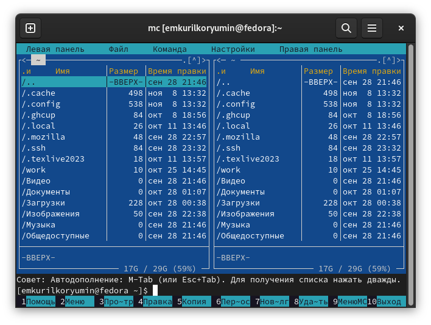{#fig:001 width=70%}

 Перехожу в каталог ~/work/arch-pc, используя файловый менеджер mc. (рис.2). 
 
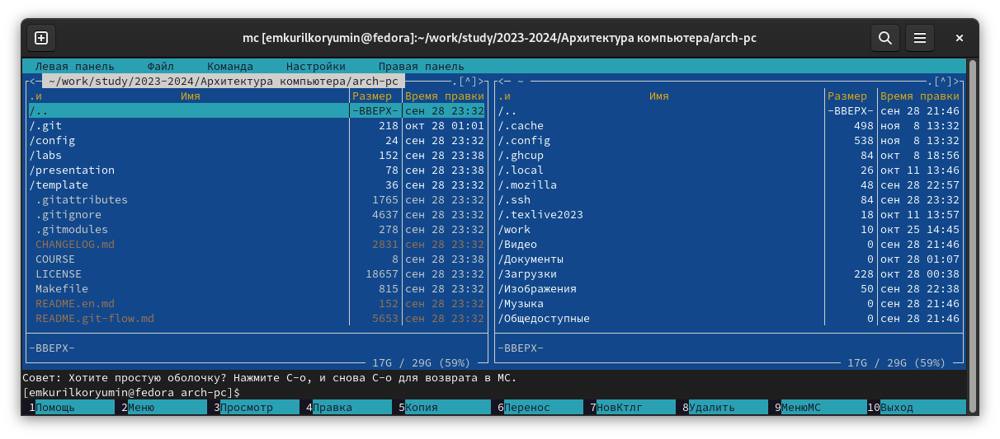{#fig:002 width=70%}
 
 С помощью функциональной клавиши F7 создаю каталог lab05 и перехожу в созданный каталог. (рис.3).

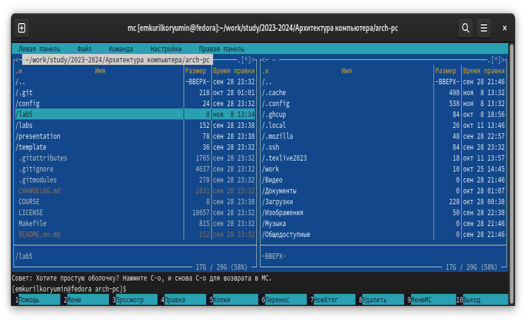{#fig:003 width=70%}

 
 В строке ввода прописываю команду touch lab5-1.asm, дабы создать соответствующий файл. (рис.4).

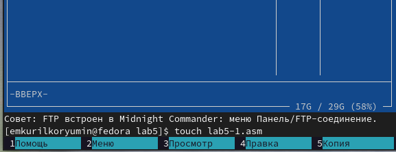{#fig:005 width=70%}
 
 С помощью функциональной клавиши F4 открываю созданный файл в режиме правки. Ввожу в файл код программы для запроса строки у пользователя, затем сохраняю изменения и выхожу из файла. (рис.5).
 
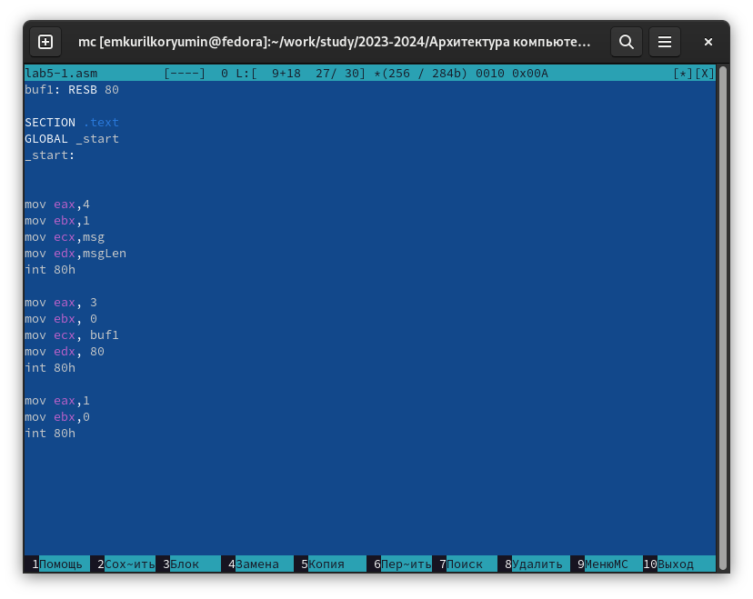{#fig:006 width=70%}

 Транслирую текст программы файла в объектный файл командой nasm -f elf lab5-1.asm. Создался объектный файл lab5-1.o. Выполняю компоновку объектного файла с помощью команды ld -m elf_i386 -o lab5-1 lab5-1.o. Создался исполняемый файл lab5-1. Запускаю исполняемый файл. Программа выводит  “Введите строку:”
и ждет ввода с клавиатуры, я ввожу свои ФИО, на этом программа заканчивает свою работу. (рис.6).

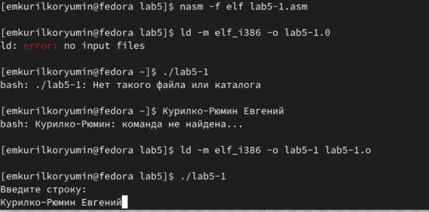{#fig:008 width=70%}

Запускаю исполняемый файл. Программа выводит строку “Введите строку:” и ждет ввода с клавиатуры, я ввожу свои ФИО, на этом программа заканчивает свою работу (рис.7).

{#fig:008 width=70%}

 4.2) Подключение внешнего файла
 
 Скачиваю файл in_out.asm со страницы курса в ТУИС. (рис.8)
 
 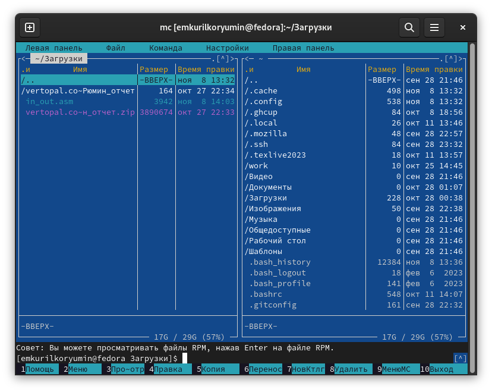
 
 С помощью функциональной клавиши F5 копирую файл in_out.asm из каталога "Загрузки", куда он скачался, в созданный каталог lab05. (рис.9).
 
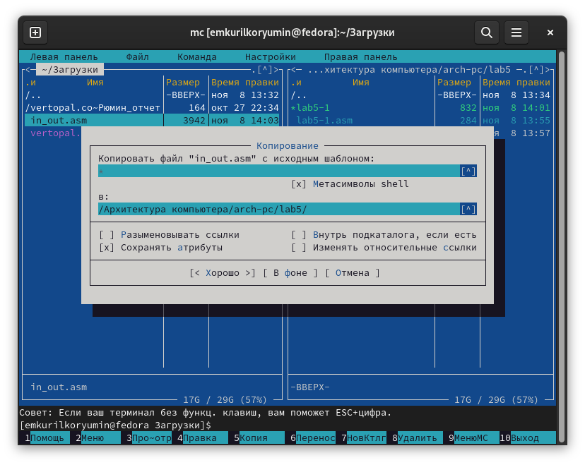{#fig:009 width=70%}

 Далее копирую файл lab5-1 в тот же каталог, но с другим именем, для этого в окне mc прописываю путь к каталогу и новое имя файла. (рис.10).
 
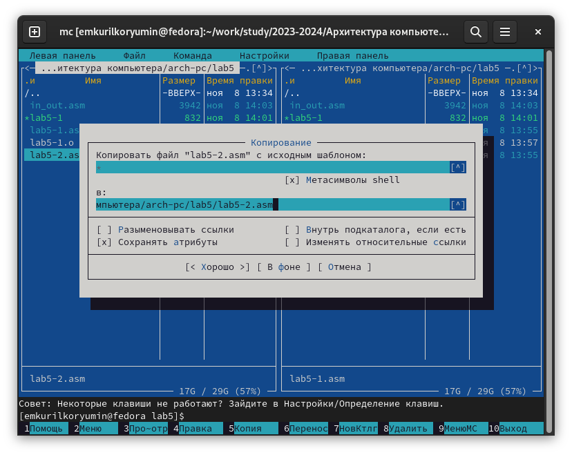{#fig:010 width=70%}

 Изменяю содержимое файла lab5-2.asm во встроенном редакторе, чтобы в программе также использовался подключенный внешний файл in_out.asm. (рис.11).

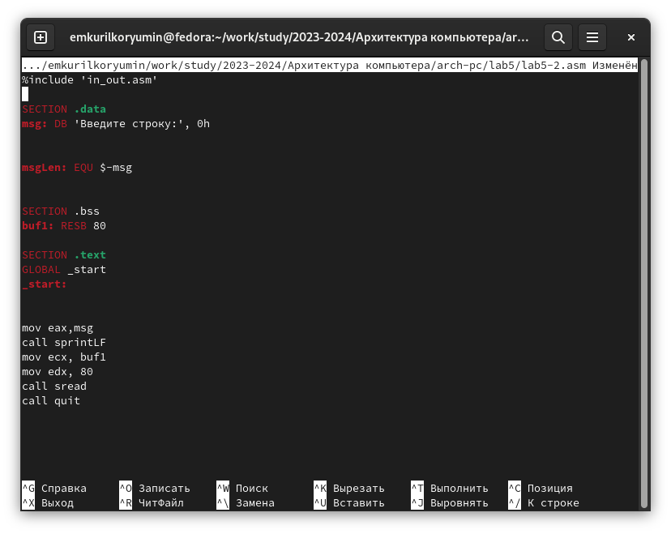{#fig:011 width=70%}

 Транслирую текст программы файла в объектный файл командой nasm -f elf lab5-2.asm. Создался объектный файл la5-2.o.Выполняю компоновку объектного файла с помощью команды ld -m elf_i386 -o lab5-2 lab5-2.o Создался исполняемый файл lab5-2. Запускаю его. (рис.12).
 
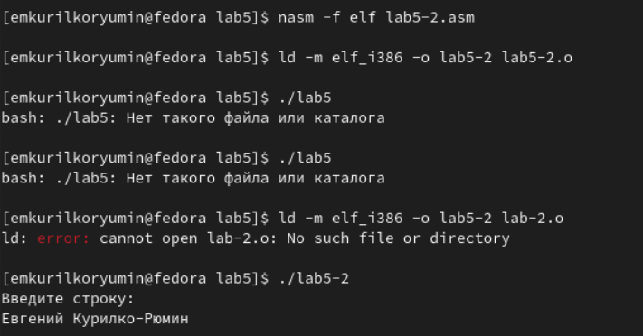{#fig:012 width=70%}

 Открываю файл lab5-2.asm в режиме редактирования, меняю в нем  sprintLF на sprint. (рис.13).
 
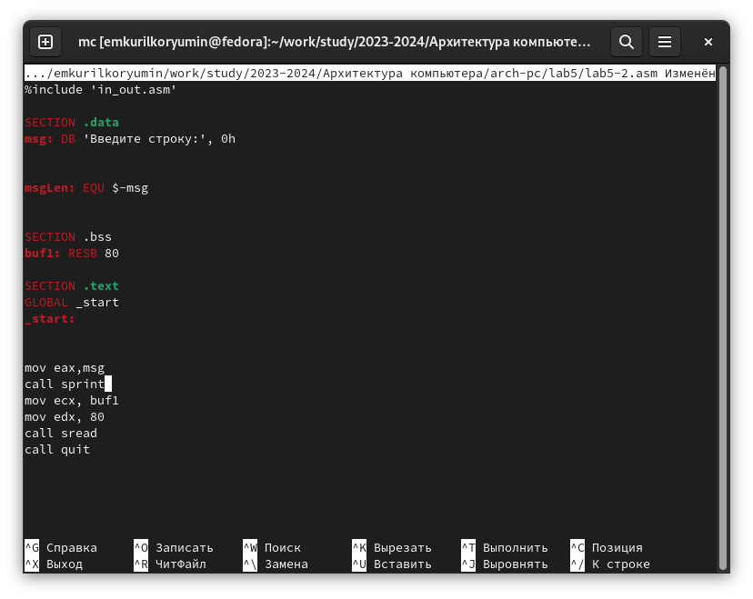{#fig:013 width=70%}

  Сохраняю изменения и транслирую файл, выполняю компоновку созданного объектного файла, в конце концов запускаю новый исполняемый файл. (рис.14).
  
{#fig:014 width=70%}

 Разница между первой и второй версией исполняемого файла состоит в том, что запуск первой запрашивает ввод с новой строки, а программа, которая исполняется при запуске второй, запрашивает ввод без переноса на новую строку, ибо в этом и заключается различие между подпрограммами sprintLF и sprint.

 4.3) Выполнение заданий для самостоятельной работы
 
 1. Создаю копию файла lab5-1.asm с именем lab5-1-а.asm. (рис.15).
 
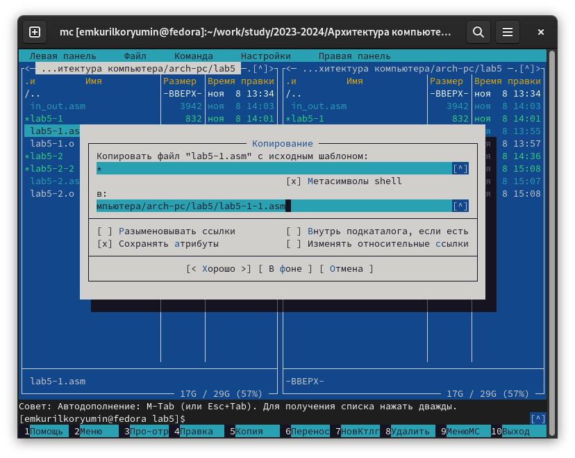{#fig:015 width=70%}
 
 Затем открываю созданный файл в режиме правки. Изменяю программу так, чтобы кроме вывода "Введите строку" и запроса ввода, она выводила вводимую пользователем строку. (рис.16)
 
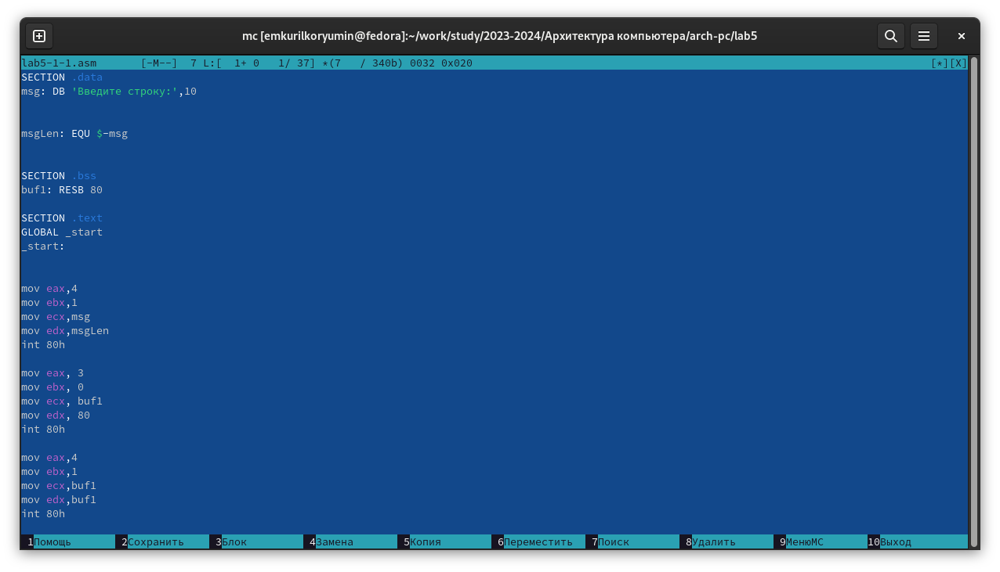{#fig:016 width=70%}

 2. Создаю объектный файл lab5-1-а.o, отдаю его на обработку компоновщику, получаю исполняемый файл lab5-1-а, запускаю полученный исполняемый файл. Программа запрашивает ввод, ввожу свои ФИО, далее программа выводит введенные мною данные.(рис.17)
 
{#fig:017 width=70%}

 3. Создаю копию файла lab5-2.asm с именем lab5-2-а.asm. (рис.18)
 
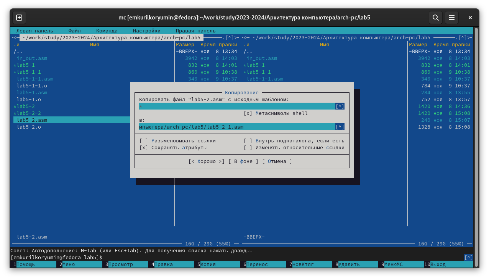{#fig:018 width=70%}

 Открываю созданный файл для редактирования. Изменяю программу так, чтобы кроме вывода приглашения и запроса ввода, она выводила вводимую пользователем строку. (рис.19)
 
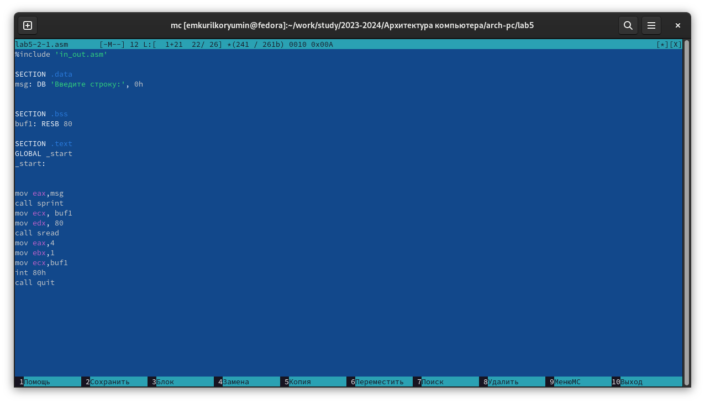{#fig:019 width=70%}

 4. Создаю объектный файл lab5-2-а.o, отдаю его на обработку компоновщику, получаю исполняемый файл lab5-2-а, запускаю полученный исполняемый файл. Затем программа запрашивает ввод без переноса на новую строку, ввожу свои ФИО, далее снова выводятся введенные мною данные. (рис.20)
 
{#fig:020 width=70%}

# Выводы

 При выполнении лабораторной работы я приобрёл практический опыт работы с Midnight Commander, освоил инструкции языка ассемблера.
 
# Список литературы{.unnumbered}

 [Архитектура ЭВМ](https://esystem.rudn.ru/pluginfile.php/2089085/mod_resource/content/0/Лабораторная%20работа%20№5.%20Основы%20работы%20с%20Midnight%20Commander%20().%20Структура%20программы%20на%20языке%20ассемблера%20NASM.%20Системные%20вызовы%20в%20ОС%20GNU%20Linux.pdf)

